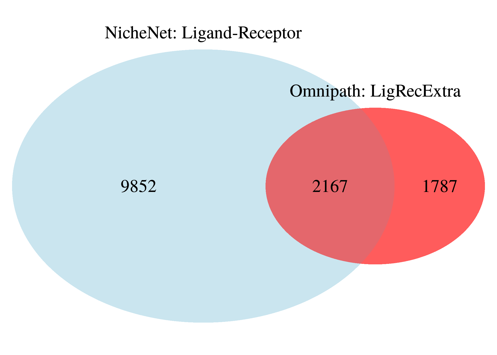
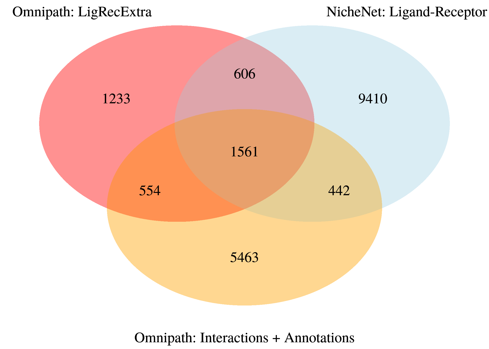
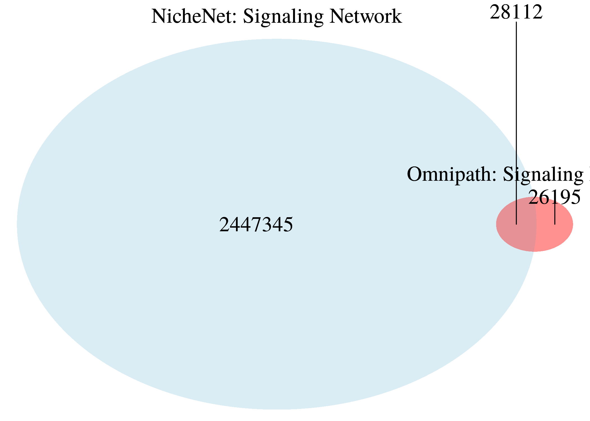
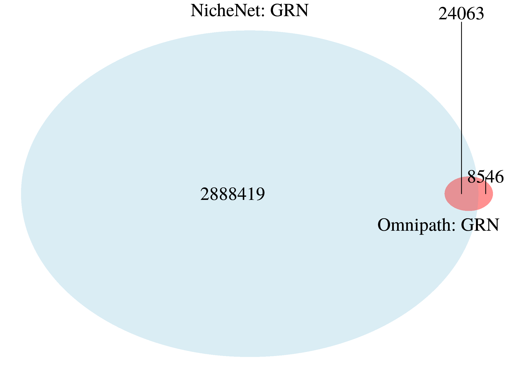
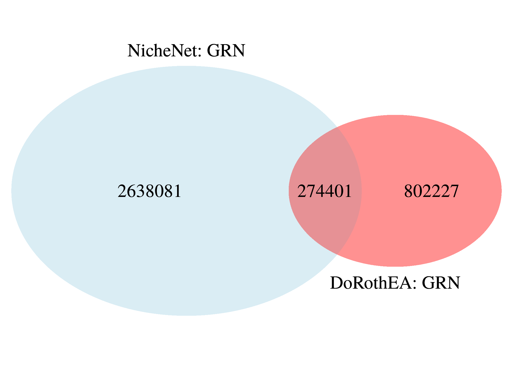

Interaction sources comparison: NicheNet VS Omnipath
================
Alberto Valdeolivas: <alberto.valdeolivas@bioquant.uni-heidelberg.de>;
Date:
08/01/2020

## Abstract

This vignette shows a comparison between the protein interaction sources
used in the NicheNet method and the ones available on Omnipath.

## The NicheNet Method

**NicheNet** (<https://github.com/saeyslab/nichenetr>) is a method to
predict ligand-target links between interacting cells by combining their
data with prior knowledge on signaling and gene regulatory networks
(Browaeys et al 2019). **NicheNet** has already been applied to predict
upstream niche signals driving Kupffer cell differentiation (Bonnardel
et al. 2019).

The figure below shows a graphical representation of the NicheNet
workflow. Interactions inferred from several complementary
ligand-receptor, signaling and gene regulatory data sources were
aggregated in respective integrated networks from which ligand-target
regulatory potential scores were calculated. This model of prior
information on potential ligand-target links can then be used to infer
active ligand-target links between interacting cells. NicheNet
prioritizes ligands according to their activity (i.e., how well they
predict observed changes in gene expression in the receiver cell) and
looks for affected targets with high potential to be regulated by these
prioritized ligands(Browaeys et al 2019).

<br><br>  <br><br>

You can find below the list of public resources used to generate the
prior model of ligand-target regulatory potential.

| **Database**               | **Source**                                    | **Reference**               |
| -------------------------- | --------------------------------------------- | --------------------------- |
| cpdb                       | cpdb\_interaction                             | Kamburov et al. (2013)      |
| cpdb                       | cpdb\_complex                                 | Kamburov et al. (2013)      |
| evex\_expression           | lr\_evex\_regulation\_expression              | Van Landeghem et al. (2012) |
| evex\_expression           | evex\_regulation\_expression                  | Van Landeghem et al. (2012) |
| evex\_signaling            | evex\_catalysis                               | Van Landeghem et al. (2012) |
| evex\_signaling            | evex\_regulation\_other                       | Van Landeghem et al. (2012) |
| evex\_signaling            | evex\_phosphorylation                         | Van Landeghem et al. (2012) |
| evex\_signaling            | evex\_regulation\_binding                     | Van Landeghem et al. (2012) |
| evex\_signaling            | evex\_binding                                 | Van Landeghem et al. (2012) |
| guide2pharmacology         | pharmacology                                  | Pawson et al. (2014)        |
| harmonizome                | harmonizome\_KEA                              | Lachmann and Ma’ayan (2009) |
| harmonizome                | harmonizome\_PhosphoSite                      | Hornbeck et al. (2015)      |
| harmonizome                | harmonizome\_kinase\_substrate\_predictions   | Rouillard et al. (2016)     |
| harmonizome                | harmonizome\_DEPOD                            | Duan et al. (2015)          |
| harmonizome\_gr            | harmonizome\_CHEA                             | Lachmann et al. (2010)      |
| harmonizome\_gr            | harmonizome\_ENCODE                           | Consortium (2004)           |
| harmonizome\_gr            | harmonizome\_JASPAR                           | Mathelier et al. (2014)     |
| harmonizome\_gr            | harmonizome\_TRANSFAC\_CUR                    | Matys et al. (2006)         |
| harmonizome\_gr            | harmonizome\_TRANSFAC                         | Matys et al. (2006)         |
| harmonizome\_gr            | harmonizome\_MOTIFMAP                         | Xie et al. (2009)           |
| harmonizome\_gr            | harmonizome\_GEO\_TF                          | Edgar et al. (2002)         |
| harmonizome\_gr            | harmonizome\_GEO\_KINASE                      | Edgar et al. (2002)         |
| harmonizome\_gr            | harmonizome\_GEO\_GENE                        | Edgar et al. (2002)         |
| harmonizome\_gr            | harmonizome\_MSIGDB\_GENE                     | Subramanian et al. (2005)   |
| HTRIDB                     | HTRIDB                                        | Bovolenta et al. (2012)     |
| inweb\_inbiomap            | inweb\_inbio\_interaction                     | Li et al. (2017)            |
| inweb\_inbiomap            | inweb\_inbio\_interaction\_pathway            | Li et al. (2017)            |
| inweb\_inbiomap            | inweb\_inbio\_pathway                         | Li et al. (2017)            |
| kegg                       | kegg\_cytokines                               | Kanehisa et al. (2016)      |
| kegg                       | kegg\_cams                                    | Kanehisa et al. (2016)      |
| kegg                       | kegg\_neuroactive                             | Kanehisa et al. (2016)      |
| kegg                       | kegg\_ecm                                     | Kanehisa et al. (2016)      |
| omnipath                   | omnipath\_directional                         | Türei et al. (2016)         |
| omnipath                   | omnipath\_undirectional                       | Türei et al. (2016)         |
| ontogenet                  | ontogenet\_coarse                             | Jojic et al. (2013)         |
| pathwaycommons\_expression | lr\_pathwaycommons\_controls\_expression\_of  | Cerami et al. (2011)        |
| pathwaycommons\_expression | pathwaycommons\_controls\_expression\_of      | Cerami et al. (2011)        |
| pathwaycommons\_signaling  | pathwaycommons\_controls\_phosphorylation\_of | Cerami et al. (2011)        |
| pathwaycommons\_signaling  | pathwaycommons\_controls\_state\_change\_of   | Cerami et al. (2011)        |
| pathwaycommons\_signaling  | pathwaycommons\_catalysis\_precedes           | Cerami et al. (2011)        |
| pathwaycommons\_signaling  | pathwaycommons\_controls\_transport\_of       | Cerami et al. (2011)        |
| pathwaycommons\_signaling  | pathwaycommons\_interacts\_with               | Cerami et al. (2011)        |
| pathwaycommons\_signaling  | pathwaycommons\_in\_complex\_with             | Cerami et al. (2011)        |
| ppi\_prediction            | ppi\_lr                                       |                             |
| ppi\_prediction            | ppi\_l\_bidir                                 |                             |
| ppi\_prediction            | ppi\_bidir\_r                                 |                             |
| ppi\_prediction            | ppi\_bidir\_bidir                             |                             |
| ppi\_prediction\_go        | ppi\_lr\_go                                   |                             |
| ppi\_prediction\_go        | ppi\_l\_bidir\_go                             |                             |
| ppi\_prediction\_go        | ppi\_bidir\_r\_go                             |                             |
| ppi\_prediction\_go        | ppi\_bidir\_bidir\_go                         |                             |
| ramilowski                 | ramilowski\_known                             | Ramilowski et al. (2015)    |
| regnetwork                 | regnetwork\_source                            | Liu et al. (2015)           |
| regnetwork                 | regnetwork\_encode                            | Liu et al. (2015)           |
| Remap                      | Remap\_5                                      | Griffon et al. (2015)       |
| trrust                     | trrust                                        | Han et al. (2015)           |
| vinayagam                  | vinayagam\_ppi                                | Vinayagam et al. (2011)     |

## Omnipath Resources

As we can see in the previous figure, **NicheNet** used many different
publically available resources to build a prior knowledge network. Their
final integrated network is composed of three individual networks:

  - A network of ligand-receptor interactions (Inter-cellular)
  - A network of signaling interactions (Intra-cellular)
  - A network of gene regulation (Intra-cellular)

The new versin of the **Omnipath** (<http://omnipathdb.org/>) database
contains curated interactions belonging to these three categories. One
can therefore build an integrated network equivalent to the one used in
**NicheNet** by only fetching the **Omnipath** webserver. This can
significantly ease the integration of different databases, each one of
them storing data in distint formats and whose interaction show
different levels of reliability.

We therefore here compare the interactions used in the **NicheNet**
method with those freely available in the **Omnipath** database. You can
find below three sections comparing each one of three different
interaction categories.

## Ligand-Receptor Interaction Network

We first load the ligand-receptor interactions used to build the
**NicheNet** model.

``` r
## We first load the required libraries to run this script
library(OmnipathR)
library(dplyr)
library(VennDiagram)
library(readr)
```

``` r
## We read the data which are freely available via Zenodo and we display
## how they look like. 
lr_Network_Nichenet <- 
    readRDS(url("https://zenodo.org/record/3260758/files/lr_network.rds"))  
lr_Network_Nichenet
## # A tibble: 12,651 x 4
##    from  to    source         database
##    <chr> <chr> <chr>          <chr>   
##  1 CXCL1 CXCR2 kegg_cytokines kegg    
##  2 CXCL2 CXCR2 kegg_cytokines kegg    
##  3 CXCL3 CXCR2 kegg_cytokines kegg    
##  4 CXCL5 CXCR2 kegg_cytokines kegg    
##  5 PPBP  CXCR2 kegg_cytokines kegg    
##  6 CXCL6 CXCR2 kegg_cytokines kegg    
##  7 CXCL8 CXCR2 kegg_cytokines kegg    
##  8 CXCL6 CXCR1 kegg_cytokines kegg    
##  9 CXCL8 CXCR1 kegg_cytokines kegg    
## 10 CXCL9 CXCR3 kegg_cytokines kegg    
## # … with 12,641 more rows
```

We show the total number of ligand-receptor interactions after removing
duplicates:

``` r
lr_Network_Nichenet_Unique <- lr_Network_Nichenet %>%
    dplyr::distinct(from, to)
nrow(lr_Network_Nichenet_Unique)
## [1] 12019
```

**Omnipath** possess a dedicated dataset storing these type of
interactions (*LigrecExtra*). We now fetch the **Omnipath** web service
to get these interactions.

``` r
## We access to the Omnipath webservice usign the OmnipathR package and we 
## display how the interactions look like.
lr_Network_Omnipath <- import_ligrecextra_interactions()  
lr_Network_Omnipath[1:6,c(3,4,5,6,7,12)]
##   source_genesymbol target_genesymbol is_directed is_stimulation is_inhibition
## 1             CALM1             TRPC3           1              0             1
## 2            NOTCH1              JAG2           1              0             1
## 3              JAG2            NOTCH1           1              1             1
## 4              DLL1            NOTCH1           1              1             0
## 5            NOTCH1              DLL1           1              1             1
## 6              IGF1             IGF1R           1              1             0
##                                                                                                                                                                          sources
## 1                                                                                                                                                   Fantom5;HPRD;LRdb;TRIP;iTALK
## 2                                                                                                                            Baccin2019;CellPhoneDB;NetPath;Ramilowski2015;SPIKE
## 3                                                Baccin2019;CellPhoneDB;EMBRACE;Fantom5;HPMR;HPRD;ICELLNET;Kirouac2010;LRdb;NetPath;Ramilowski2015;SignaLink3;UniProt;Wang;iTALK
## 4                                                       Baccin2019;CellPhoneDB;EMBRACE;Fantom5;HPMR;HPRD;Kirouac2010;LRdb;NetPath;Ramilowski2015;SIGNOR;SPIKE;UniProt;Wang;iTALK
## 5                                                                                                                        Baccin2019;NetPath;Ramilowski2015;SPIKE;SignaLink3;Wang
## 6 Baccin2019;CA1;CellPhoneDB;DIP;EMBRACE;Fantom5;Guide2Pharma;HPMR;HPRD;KEGG;Kirouac2010;LRdb;ProtMapper;REACH;Ramilowski2015;SIGNOR;SPIKE;SignaLink3;Sparser;UniProt;Wang;iTALK
```

We show the total number of ligand-receptor interactions available in
the **Omnipath** *LigrecExtra* dataset after removing duplicates:

``` r
## We also remove self-interactions in case they exist
lr_Network_Omnipath_Unique <- lr_Network_Omnipath %>%
    dplyr::distinct(source_genesymbol,target_genesymbol) %>%
    dplyr::rename(from=source_genesymbol, to=target_genesymbol) %>%
    dplyr::filter(from != to)
nrow(lr_Network_Omnipath_Unique)
## [1] 3954
```

We display the number of matching interactions between different sources
with a Venn diagram:

``` r
Venn_plot <- draw.pairwise.venn(nrow(lr_Network_Nichenet_Unique), 
    nrow(lr_Network_Omnipath_Unique), 
    nrow(dplyr::intersect(lr_Network_Nichenet_Unique,
    lr_Network_Omnipath_Unique)), 
    category = c("NicheNet: Ligand-Receptor", "Omnipath: LigRecExtra"), 
    lty = rep("blank", 2), fill = c("light blue", "red"), alpha = rep(0.4, 2), 
    cat.pos = c(0, 0), cat.dist = rep(0.025, 2), cex= 1.5, cat.cex=1.5, 
    verbose = FALSE)
grid.draw(Venn_plot)
```

<!-- -->

In **NicheNet**, the authors predicted ligand–receptor interactions by
searching in protein–protein interaction databases for interactions
between genes annotated as ligands and receptors (Browaeys et al 2019).

We can also do something similar using **Omnipath**. The new version of
**Omnipath** also contains protein annotations describing roles in
inter-cellular signaling, e.g. if a protein is a ligand, a receptor, an
extracellular matrix (ECM) component, etc… Thus, we selected proteins
annotated as ligand or receptors and we searched for interactions
between them (with ligands as sources of interactions and receptors as
sources). The process is described in the following code chunks:

``` r
## We import Omnipath Inter cellular annotations
InterCell_Annotations <- import_omnipath_intercell() 

## We filter those proteins which are mainly annotated as receptor or ligand
Ligands_Receptors <- InterCell_Annotations %>%
    dplyr::filter(category %in% c("receptor","ligand"))

## There are also some complexes. We are going to deal with them by including
## each of its individual proteins in our list
Ligand_Receptors_class <- character()
Ligand_Receptors_name <- character()
for (i in seq(nrow(Ligands_Receptors))){
    if (Ligands_Receptors$entity_type[i] == "complex"){
        Genescomplex <-unlist(strsplit(gsub("COMPLEX:", "", 
            Ligands_Receptors$genesymbol[i]),"_"))
        class <- rep(Ligands_Receptors$category[i],length(Genescomplex))
        Ligand_Receptors_name <- c(Ligand_Receptors_name,Genescomplex)
        Ligand_Receptors_class <- c(Ligand_Receptors_class,class)
        
    } else {
        Ligand_Receptors_name <- 
            c(Ligand_Receptors_name, Ligands_Receptors$genesymbol[i]) 
        Ligand_Receptors_class <- 
            c(Ligand_Receptors_class, Ligands_Receptors$category[i]) 
    }
}
```

We remove duplicates and we display the number of proteins that we have
annotated as ligand or receptors.

``` r
Ligand_Receptors_df <- data.frame(GeneSymbol = Ligand_Receptors_name, 
    Class = Ligand_Receptors_class, stringsAsFactors = FALSE) %>%
    dplyr::distinct()
AllLigands_vec <- 
    dplyr::filter(Ligand_Receptors_df, Class == "ligand") %>%
    dplyr::pull(GeneSymbol)
AllReceptors_vec <- 
    dplyr::filter(Ligand_Receptors_df, Class == "receptor") %>%
    dplyr::pull(GeneSymbol)
table(Ligand_Receptors_df$Class)
## 
##   ligand receptor 
##     1049     2328
```

We next get protein-protein interactions from the different datasets
availabe in **Omnipath**

``` r
AllInteractions <- 
    import_post_translational_interactions(exclude = "ligrecextra") %>% 
    dplyr::select(source_genesymbol, target_genesymbol) %>% 
    dplyr::distinct() %>% 
    dplyr::rename(from=source_genesymbol, to=target_genesymbol)
```

``` r
nrow(AllInteractions)
## [1] 77799
```

Now, we search for pairs of proteins annotated as ligand and receptor
with an interaction between them.

``` r
## Do the other way around? I only used from=ligands and to=receptors 
Matching_Interactions_Annotations <- AllInteractions %>%
    dplyr::filter(from %in% AllLigands_vec) %>%
    dplyr::filter(to %in% AllReceptors_vec) %>%
    dplyr::distinct()
nrow(Matching_Interactions_Annotations)
## [1] 8020
```

We finally display the number of matching interactions between the
different sources with a Venn diagram:

``` r
Venn_plot <- draw.triple.venn(nrow(lr_Network_Nichenet_Unique), 
    nrow(lr_Network_Omnipath_Unique), 
    nrow(Matching_Interactions_Annotations), 
    n12 = nrow(dplyr::intersect(lr_Network_Nichenet_Unique,
        lr_Network_Omnipath_Unique)), 
    n23 = nrow(dplyr::intersect(lr_Network_Omnipath_Unique, 
        Matching_Interactions_Annotations)),
    n13 = nrow(dplyr::intersect(lr_Network_Nichenet_Unique, 
        Matching_Interactions_Annotations)), 
    n123 = nrow(dplyr::intersect(dplyr::intersect(lr_Network_Nichenet_Unique, 
        lr_Network_Omnipath_Unique), 
        Matching_Interactions_Annotations)),
    category = c("NicheNet: Ligand-Receptor", "Omnipath: LigRecExtra",
        "Omnipath: Interactions + Annotations"), 
    lty = rep("blank", 3), fill = c("light blue", "red","orange"), 
    alpha = rep(0.25, 3), euler.d = TRUE, scaled=TRUE,
    rotation.degree = 0, reverse=TRUE, cex=1.25, cat.pos = c(330, 30 , 180), 
    cat.dist = rep(0.075, 3), cat.cex = 1.25)
grid.draw(Venn_plot)
```

<!-- -->

## Signaling Network

In this section, we compare the singaling network used to build
**NicheNet** with the one available through **Omnipath**. We first load
the signaling interactions used to build the **NicheNet** model.

``` r
## We read the data which are freely available via Zenodo and we display
## how they look like. 
sig_Network_Nichenet <- 
    readRDS(url("https://zenodo.org/record/3260758/files/signaling_network.rds"))
sig_Network_Nichenet
## # A tibble: 3,621,987 x 4
##    from    to    source                                   database              
##    <chr>   <chr> <chr>                                    <chr>                 
##  1 BTRC    PDCD4 omnipath_directional                     omnipath              
##  2 RPS6KB1 PDCD4 omnipath_directional                     omnipath              
##  3 RPS6KB1 PDCD4 pathwaycommons_controls_phosphorylation… pathwaycommons_signal…
##  4 RPS6KB1 PDCD4 pathwaycommons_controls_state_change_of  pathwaycommons_signal…
##  5 RPS6KB1 PDCD4 harmonizome_KEA                          harmonizome           
##  6 RPS6KB1 PDCD4 harmonizome_PhosphoSite                  harmonizome           
##  7 AKT1    PDCD4 omnipath_directional                     omnipath              
##  8 AKT1    PDCD4 pathwaycommons_controls_phosphorylation… pathwaycommons_signal…
##  9 AKT1    PDCD4 pathwaycommons_controls_state_change_of  pathwaycommons_signal…
## 10 AKT1    PDCD4 harmonizome_KEA                          harmonizome           
## # … with 3,621,977 more rows
```

We show the total number of ligand-receptor interactions after removing
duplicates:

``` r
sig_Network_Nichenet_Unique <- sig_Network_Nichenet %>%
    dplyr::distinct(from, to)
nrow(sig_Network_Nichenet_Unique)
## [1] 2475457
```

We generate a signaling network using **Omnipath** resources:

``` r
sig_Interactions_Omnipath <-     
    import_post_translational_interactions(exclude = "ligrecextra") %>% 
    dplyr::rename(from=source_genesymbol, to=target_genesymbol) %>% 
    dplyr::filter(consensus_direction == "1") %>% 
    dplyr::distinct(from, to, .keep_all = TRUE)  %>%
    dplyr::select(from, to) 

sig_Network_Omnipath <- sig_Interactions_Omnipath %>%
    dplyr::distinct()
nrow(sig_Network_Omnipath)
## [1] 54307
```

We finally display the number of matching interactions between the
different sources with a Venn diagram:

``` r
Venn_plot <- draw.pairwise.venn(nrow(sig_Network_Nichenet_Unique), 
    nrow(sig_Network_Omnipath), 
    nrow(dplyr::intersect(sig_Network_Nichenet_Unique,
    sig_Network_Omnipath)), 
    category = c("NicheNet: Signaling Network", 
        "Omnipath: Signaling Network"), 
    lty = rep("blank", 2), fill = c("light blue", "red"), alpha = rep(0.25, 2), 
    cat.pos = c(0, 0), cat.dist = rep(0.025, 2), cex= 1.5, cat.cex=1.5)
grid.draw(Venn_plot)
```

<!-- -->

## Gene Regulatory Network

In this section, we compare the GRN network used to build **NicheNet**
with the **DoRothEA** regulons available through **Omnipath**. We first
load the GNR interactions used to build the **NicheNet** model.

``` r
## We read the data which are freely available via Zenodo and we display
## how they look like. 
gr_Network_Nichenet <-
    readRDS(url("https://zenodo.org/record/3260758/files/gr_network.rds"))
gr_Network_Nichenet
## # A tibble: 3,592,299 x 4
##    from  to      source           database      
##    <chr> <chr>   <chr>            <chr>         
##  1 KLF2  DLGAP1  harmonizome_CHEA harmonizome_gr
##  2 KLF2  DTNB    harmonizome_CHEA harmonizome_gr
##  3 KLF2  BHLHE40 harmonizome_CHEA harmonizome_gr
##  4 KLF2  RPS6KA1 harmonizome_CHEA harmonizome_gr
##  5 KLF2  PXN     harmonizome_CHEA harmonizome_gr
##  6 KLF2  UBE2V1  harmonizome_CHEA harmonizome_gr
##  7 KLF2  MSRA    harmonizome_CHEA harmonizome_gr
##  8 KLF2  TEX14   harmonizome_CHEA harmonizome_gr
##  9 KLF2  CYLD    harmonizome_CHEA harmonizome_gr
## 10 KLF2  RYBP    harmonizome_CHEA harmonizome_gr
## # … with 3,592,289 more rows
```

We show the total number of ligand-receptor interactions after removing
duplicates:

``` r
gr_Network_Nichenet_unique <- gr_Network_Nichenet %>%
    dplyr::distinct(from, to)
nrow(gr_Network_Nichenet_unique)
## [1] 2912482
```

We generate a GRN network using **Omnipath** resources:

``` r
gr_Interactions_Omnipath <- 
    import_dorothea_interactions(dorothea_levels = c('A','B','C')) %>%  
    dplyr::select(source_genesymbol, target_genesymbol) %>% 
    dplyr::rename(from=source_genesymbol, to=target_genesymbol) %>%
    dplyr::distinct(from, to)
nrow(gr_Interactions_Omnipath)
## [1] 32609
```

We finally display the number of matching interactions between the
different sources with a Venn diagram:

``` r
Venn_plot <- 
    draw.pairwise.venn(nrow(gr_Network_Nichenet_unique), 
    nrow(gr_Interactions_Omnipath), 
    nrow(dplyr::intersect(gr_Network_Nichenet_unique,gr_Interactions_Omnipath)), 
    category = c("NicheNet: GRN", "Omnipath: GRN"), 
    lty = rep("blank", 2), fill = c("light blue", "red"), alpha = rep(0.25, 2), 
    cat.pos = c(0, 215), cat.dist = rep(0.025, 2), cex= 1.5, cat.cex=1.5)
grid.draw(Venn_plot)
```

<!-- -->

it is to note that **DoRothEA** contains some additional interactions
which are not available in the **Omnipath** web server. We now compare
**NicheNet** gene regulatory interaction with the all **DoRothEA**
regulons.

``` r
## To download from: 
## https://github.com/saezlab/DoRothEA/tree/master/data/TFregulons/consensus/table
full_dorothea <- read_csv("DoRothEA/database.csv")

full_dorothea_unique <- full_dorothea %>%  
    dplyr::select(TF,target) %>%
    dplyr::rename(from=TF, to=target) %>%
    dplyr::distinct(from,to)
nrow(full_dorothea_unique)
## [1] 1076628
```

``` r
Venn_plot <- draw.pairwise.venn(nrow(gr_Network_Nichenet_unique), 
    nrow(full_dorothea_unique), 
    nrow(dplyr::intersect(gr_Network_Nichenet_unique,
    full_dorothea_unique)), 
    category = c("NicheNet: GRN", "DoRothEA: GRN"), 
    lty = rep("blank", 2), fill = c("light blue", "red"), alpha = rep(0.25, 2), 
    cat.pos = c(0, 180), cat.dist = rep(0.025, 2), cex= 1.5, cat.cex=1.5)
grid.draw(Venn_plot)
```

<!-- -->

## References

Bonnardel et al. Stellate Cells, Hepatocytes, and Endothelial Cells
Imprint the Kupffer Cell Identity on Monocytes Colonizing the Liver
Macrophage Niche. Immunity (2019) <doi:10.1016/j.immuni.2019.08.017>

Browaeys, R., Saelens, W. & Saeys, Y. NicheNet: modeling intercellular
communication by linking ligands to target genes. Nat Methods (2019)
<doi:10.1038/s41592-019-0667-5>
