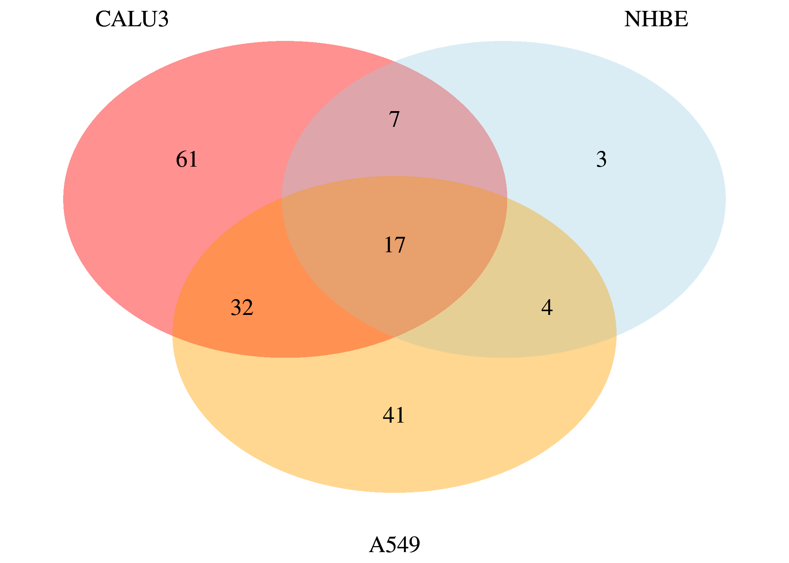

SARS-CoV-2 dataset: Differential expression analysis
================
Alberto Valdeolivas: <alberto.valdeolivas@bioquant.uni-heidelberg.de>;
Date:
14/04/2020

### License Info

This program is free software: you can redistribute it and/or modify it
under the terms of the GNU General Public License as published by the
Free Software Foundation, either version 3 of the License, or (at your
option) any later version.

This program is distributed in the hope that it will be useful, but
WITHOUT ANY WARRANTY; without even the implied warranty of
MERCHANTABILITY or FITNESS FOR A PARTICULAR PURPOSE. See the GNU General
Public License for more details.

Please check <http://www.gnu.org/licenses/>.

## Introduction

The present script takes the RNAseq data from the study *"SARS-CoV-2
launches* *a unique transcriptional signature from in vitro, ex vivo,
and in vivo systems"*

<https://www.biorxiv.org/content/10.1101/2020.03.24.004655v1>

<https://www.ncbi.nlm.nih.gov/geo/query/acc.cgi?acc=GSE147507>

It performs a differential expression analysis to compare:

  - Human lung epithelial cells (NHBE): mock treated vs infected with
    SARS-CoV-2.

  - A549 alveolar cancer cell line: mock treated vs infected with
    SARS-CoV-2.

  - Calu-3 human lung epithelial cancer cell line: mock treated vs
    infected with SARS-CoV-2.

We used the *DESeq2* R package.

## Getting Started

We first load the required libraries.

``` r
library(dplyr)
library(DESeq2)
library(tibble)
library(VennDiagram)
library(fgsea)
```

We also read the raw counts from the original experiment (GSE147507)

``` r
## Raw counts table
GSE147507_raw_counts <- 
    read.csv("GSE147507_RawReadCounts_Human.tsv", sep = "\t")
```

## NHBE mock treated vs infected with SARS-CoV-2

We first select the Series 1, which corresponds to independent
biological triplicates of primary human lung epithelium (NHBE) that were
either mock treated or infected with SARS-CoV-2.

``` r
## We select series 1 as described above.
count_NHBEvsCOV2_df <- GSE147507_raw_counts[,c(2:7)]
row.names(count_NHBEvsCOV2_df) <- GSE147507_raw_counts$X
```

We create a dataframe describing the experimental design.

``` r
targets_NHBEvsCOV2 <- 
    as.data.frame(matrix(NA,length(names(count_NHBEvsCOV2_df)),1))
names(targets_NHBEvsCOV2) <- c("condition")
row.names(targets_NHBEvsCOV2) <- names(count_NHBEvsCOV2_df)
targets_NHBEvsCOV2$condition <- 
    gsub("Series1_", "", row.names(targets_NHBEvsCOV2))
targets_NHBEvsCOV2$condition <- 
    factor(gsub("_[1-3]$", "", targets_NHBEvsCOV2$condition))
targets_NHBEvsCOV2
```

    ##                                 condition
    ## Series1_NHBE_Mock_1             NHBE_Mock
    ## Series1_NHBE_Mock_2             NHBE_Mock
    ## Series1_NHBE_Mock_3             NHBE_Mock
    ## Series1_NHBE_SARS.CoV.2_1 NHBE_SARS.CoV.2
    ## Series1_NHBE_SARS.CoV.2_2 NHBE_SARS.CoV.2
    ## Series1_NHBE_SARS.CoV.2_3 NHBE_SARS.CoV.2

Then, we perform the differential expression analysis with *DESeq2*

``` r
## Create deseq2 object
dds_NHBEvsCOV2 <- 
    DESeqDataSetFromMatrix(countData = as.matrix(count_NHBEvsCOV2_df), 
    colData = targets_NHBEvsCOV2, design = ~ condition)

## Set control
dds_NHBEvsCOV2$condition <- relevel(dds_NHBEvsCOV2$condition, 
    ref = levels(targets_NHBEvsCOV2$condition)[1])

## Carry out diff exp
dds_NHBEvsCOV2 <- DESeq(dds_NHBEvsCOV2)
```

We finally save the table with the results of the analysis and the
normalised counts

``` r
## See the comparisons carried out
comparison_NHBEvsCOV2 <- resultsNames(dds_NHBEvsCOV2)

## Get results table
results_NHBEvsCOV2 <- 
    results(dds_NHBEvsCOV2, name=comparison_NHBEvsCOV2[2])

## Save the object
saveRDS(results_NHBEvsCOV2, file="Results/dds_results_NHBEvsCOV2.rds")

## Extract normalised counts data
dds_NHBEvsCOV2 <- estimateSizeFactors(dds_NHBEvsCOV2)
norm_counts_NHBEvsCOV2 <- counts(dds_NHBEvsCOV2, normalized = TRUE)
saveRDS(norm_counts_NHBEvsCOV2, 
    file="Results/counts_norm_NHBEvsCOV2.rds")
```

## A549 mock treated vs infected with SARS-CoV-2

We first select the Series 5, which corresponds to independent
biological triplicates of alveolar cancer cell line (A549) that were
either mock treated or infected with SARS-CoV-2.

``` r
## We select series 5 as described above.
count_A549vsCOV2_df <- GSE147507_raw_counts[,c(22:27)]
row.names(count_A549vsCOV2_df) <- GSE147507_raw_counts$X
```

We create a dataframe describing the experimental design.

``` r
targets_A549vsCOV2 <- 
    as.data.frame(matrix(NA,length(names(count_A549vsCOV2_df)),1))
names(targets_A549vsCOV2) <- c("condition")
row.names(targets_A549vsCOV2) <- names(count_A549vsCOV2_df)
targets_A549vsCOV2$condition <- 
    gsub("Series5_", "", row.names(targets_A549vsCOV2))
targets_A549vsCOV2$condition <- 
    factor(gsub("_[1-3]$", "", targets_A549vsCOV2$condition))
targets_A549vsCOV2
```

    ##                                 condition
    ## Series5_A549_Mock_1             A549_Mock
    ## Series5_A549_Mock_2             A549_Mock
    ## Series5_A549_Mock_3             A549_Mock
    ## Series5_A549_SARS.CoV.2_1 A549_SARS.CoV.2
    ## Series5_A549_SARS.CoV.2_2 A549_SARS.CoV.2
    ## Series5_A549_SARS.CoV.2_3 A549_SARS.CoV.2

Then, we perform the differential expression analysis with *DESeq2*

``` r
## Create deseq2 object
dds_A549vsCOV2 <- 
    DESeqDataSetFromMatrix(countData = as.matrix(count_A549vsCOV2_df), 
    colData = targets_A549vsCOV2, design = ~ condition)

## Set control
dds_A549vsCOV2$condition <- relevel(dds_A549vsCOV2$condition, 
    ref = levels(targets_A549vsCOV2$condition)[1])

## Carry out diff exp
dds_A549vsCOV2 <- DESeq(dds_A549vsCOV2)
```

We finally save the table with the results of the analysis and the
normalised counts

``` r
## See the comparisons carried out
comparison_A549vsCOV2 <- resultsNames(dds_A549vsCOV2)

## Get results table
results_A549vsCOV2 <- 
    results(dds_A549vsCOV2, name=comparison_A549vsCOV2[2])

## Save the object
saveRDS(results_A549vsCOV2,
    file="Results/dds_results_A549vsCOV2.rds")

## Extract normalised counts data
dds_A549vsCOV2 <- estimateSizeFactors(dds_A549vsCOV2)
norm_counts_A549vsCOV2 <- counts(dds_A549vsCOV2, normalized = TRUE)
saveRDS(norm_counts_A549vsCOV2, 
    file="Results/counts_norm_A549vsCOV2.rds")
```

## CALU-3 mock treated vs infected with SARS-CoV-2

We then select the Series 7, which corresponds to independent biological
triplicates of a human lung epithelium cancer cell line named Calu-3,
that were either mock treated or infected with SARS-CoV-2.

``` r
## We select series 7 as described above.
count_CALU3vsCOV2_df <- GSE147507_raw_counts[,c(34:39)]
row.names(count_CALU3vsCOV2_df) <- GSE147507_raw_counts$X
```

We create a dataframe describing the experimental design.

``` r
targets_CALU3vsCOV2 <- 
    as.data.frame(matrix(NA,length(names(count_CALU3vsCOV2_df)),1))
names(targets_CALU3vsCOV2) <- c("condition")
row.names(targets_CALU3vsCOV2) <- names(count_CALU3vsCOV2_df)
targets_CALU3vsCOV2$condition <- 
    gsub("Series1_", "", row.names(targets_CALU3vsCOV2))
targets_CALU3vsCOV2$condition <- 
    factor(gsub("_[1-3]$", "", targets_CALU3vsCOV2$condition))
targets_CALU3vsCOV2
```

    ##                                           condition
    ## Series7_Calu3_Mock_1             Series7_Calu3_Mock
    ## Series7_Calu3_Mock_2             Series7_Calu3_Mock
    ## Series7_Calu3_Mock_3             Series7_Calu3_Mock
    ## Series7_Calu3_SARS.CoV.2_1 Series7_Calu3_SARS.CoV.2
    ## Series7_Calu3_SARS.CoV.2_2 Series7_Calu3_SARS.CoV.2
    ## Series7_Calu3_SARS.CoV.2_3 Series7_Calu3_SARS.CoV.2

Then, we perform the differential expression analysis with *DESeq2*

``` r
## Create deseq2 object
dds_CALU3vsCOV2 <- 
    DESeqDataSetFromMatrix(countData = as.matrix(count_CALU3vsCOV2_df), 
    colData = targets_CALU3vsCOV2, design = ~ condition)

## Set control
dds_CALU3vsCOV2$condition <- relevel(dds_CALU3vsCOV2$condition, 
    ref = levels(targets_CALU3vsCOV2$condition)[1])

## Carry out diff exp
dds_CALU3vsCOV2 <- DESeq(dds_CALU3vsCOV2)
```

We finally save the table with the results of the analysis and the
normalised counts

``` r
## See the comparisons carried out
comparison_CALU3vsCOV2 <- resultsNames(dds_CALU3vsCOV2)

## Get results table
results_CALU3vsCOV2 <- 
    results(dds_CALU3vsCOV2, name=comparison_CALU3vsCOV2[2])

## Save the object
saveRDS(results_CALU3vsCOV2, file="Results/dds_results_CALU3vsCOV2.rds")

## Extract normalised counts data
dds_CALU3vsCOV2 <- estimateSizeFactors(dds_CALU3vsCOV2)
norm_counts_CALU3vsCOV2 <- counts(dds_CALU3vsCOV2, normalized = TRUE)
saveRDS(norm_counts_CALU3vsCOV2, 
    file="Results/counts_norm_CALU3vsCOV2.rds")
```

## We check the number of ligands over-expressed in every cell line.

``` r
padj_tres <- 0.1
log2FoldChange_tres <- 1

ligands <- 
    readRDS("OmniNetworks_NNformat/lr_Network_Omnipath.rds") %>%
    dplyr::pull(from) %>% 
    unique()

DDS_NHBE_ligands <- 
    results_NHBEvsCOV2 %>%
    as.data.frame() %>% 
    tibble::rownames_to_column(var = "Gene") %>%
    dplyr::filter(padj < padj_tres, 
                  log2FoldChange > log2FoldChange_tres, 
                  Gene %in% ligands) %>%
    dplyr::pull(Gene)

DDS_CALU3_ligands <- 
    results_CALU3vsCOV2 %>%
    as.data.frame() %>% 
    tibble::rownames_to_column(var = "Gene") %>%
    dplyr::filter(padj < padj_tres, 
                  log2FoldChange > log2FoldChange_tres, 
                  Gene %in% ligands) %>%
    dplyr::pull(Gene)

DDS_A549_ligands <- 
    results_A549vsCOV2 %>%
    as.data.frame() %>% 
    tibble::rownames_to_column(var = "Gene") %>%
    dplyr::filter(padj < padj_tres, 
                  log2FoldChange > log2FoldChange_tres, 
                  Gene %in% ligands)  %>%
    dplyr::pull(Gene)

Venn_plot <- draw.triple.venn(length(DDS_NHBE_ligands), 
    length(DDS_CALU3_ligands), 
    length(DDS_A549_ligands), 
    n12 = length(intersect(DDS_NHBE_ligands,
        DDS_CALU3_ligands)), 
    n23 = length(intersect(DDS_CALU3_ligands, 
        DDS_A549_ligands)),
    n13 = length(intersect(DDS_NHBE_ligands, 
        DDS_A549_ligands)), 
    n123 = length(intersect(intersect(DDS_NHBE_ligands, 
        DDS_CALU3_ligands), 
        DDS_A549_ligands)),
    category = c("NHBE", "CALU3","A549"), 
    lty = rep("blank", 3), fill = c("light blue", "red","orange"), 
    alpha = rep(0.25, 3), euler.d = TRUE, scaled=TRUE,
    rotation.degree = 0, reverse=TRUE, cex=1.25, cat.pos = c(330, 30 , 180), 
    cat.dist = rep(0.075, 3), cat.cex = 1.25)
grid.draw(Venn_plot)
```

<!-- -->

## Session Info Details

    ## R version 4.0.1 (2020-06-06)
    ## Platform: x86_64-pc-linux-gnu (64-bit)
    ## Running under: Ubuntu 19.10
    ## 
    ## Matrix products: default
    ## BLAS:   /usr/lib/x86_64-linux-gnu/openblas/libblas.so.3
    ## LAPACK: /usr/lib/x86_64-linux-gnu/libopenblasp-r0.3.7.so
    ## 
    ## locale:
    ##  [1] LC_CTYPE=en_GB.UTF-8       LC_NUMERIC=C              
    ##  [3] LC_TIME=en_GB.UTF-8        LC_COLLATE=en_GB.UTF-8    
    ##  [5] LC_MONETARY=en_GB.UTF-8    LC_MESSAGES=en_GB.UTF-8   
    ##  [7] LC_PAPER=en_GB.UTF-8       LC_NAME=C                 
    ##  [9] LC_ADDRESS=C               LC_TELEPHONE=C            
    ## [11] LC_MEASUREMENT=en_GB.UTF-8 LC_IDENTIFICATION=C       
    ## 
    ## attached base packages:
    ##  [1] grid      parallel  stats4    stats     graphics  grDevices utils    
    ##  [8] datasets  methods   base     
    ## 
    ## other attached packages:
    ##  [1] fgsea_1.14.0                VennDiagram_1.6.20         
    ##  [3] futile.logger_1.4.3         tibble_3.0.1               
    ##  [5] DESeq2_1.28.1               SummarizedExperiment_1.18.1
    ##  [7] DelayedArray_0.14.0         matrixStats_0.56.0         
    ##  [9] Biobase_2.48.0              GenomicRanges_1.40.0       
    ## [11] GenomeInfoDb_1.24.0         IRanges_2.22.2             
    ## [13] S4Vectors_0.26.1            BiocGenerics_0.34.0        
    ## [15] dplyr_1.0.0                
    ## 
    ## loaded via a namespace (and not attached):
    ##  [1] Rcpp_1.0.4.6           locfit_1.5-9.4         lattice_0.20-41       
    ##  [4] digest_0.6.25          R6_2.4.1               futile.options_1.0.1  
    ##  [7] RSQLite_2.2.0          evaluate_0.14          ggplot2_3.3.1         
    ## [10] pillar_1.4.4           zlibbioc_1.34.0        rlang_0.4.6           
    ## [13] data.table_1.12.8      annotate_1.66.0        blob_1.2.1            
    ## [16] Matrix_1.2-18          rmarkdown_2.2          splines_4.0.1         
    ## [19] BiocParallel_1.22.0    geneplotter_1.66.0     stringr_1.4.0         
    ## [22] RCurl_1.98-1.2         bit_1.1-15.2           munsell_0.5.0         
    ## [25] compiler_4.0.1         xfun_0.14              pkgconfig_2.0.3       
    ## [28] htmltools_0.4.0        tidyselect_1.1.0       gridExtra_2.3         
    ## [31] GenomeInfoDbData_1.2.3 XML_3.99-0.3           crayon_1.3.4          
    ## [34] bitops_1.0-6           xtable_1.8-4           gtable_0.3.0          
    ## [37] lifecycle_0.2.0        DBI_1.1.0              formatR_1.7           
    ## [40] magrittr_1.5           scales_1.1.1           stringi_1.4.6         
    ## [43] XVector_0.28.0         genefilter_1.70.0      ellipsis_0.3.1        
    ## [46] generics_0.0.2         vctrs_0.3.1            fastmatch_1.1-0       
    ## [49] lambda.r_1.2.4         RColorBrewer_1.1-2     tools_4.0.1           
    ## [52] bit64_0.9-7            glue_1.4.1             purrr_0.3.4           
    ## [55] survival_3.1-12        yaml_2.2.1             AnnotationDbi_1.50.0  
    ## [58] colorspace_1.4-1       memoise_1.1.0          knitr_1.28
