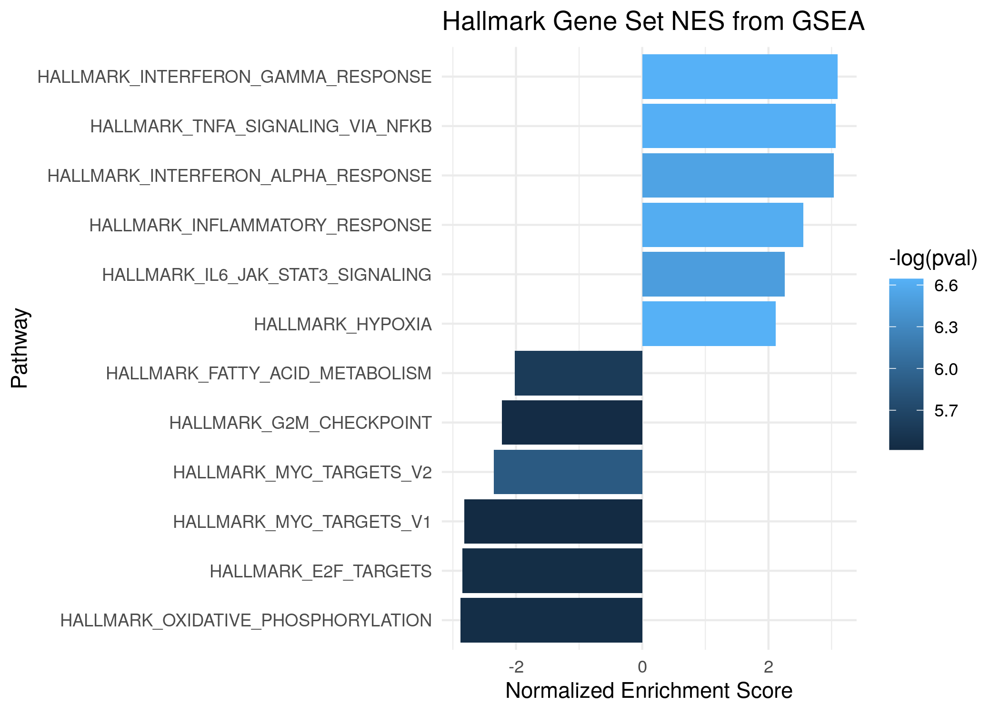
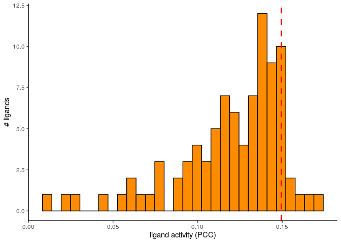
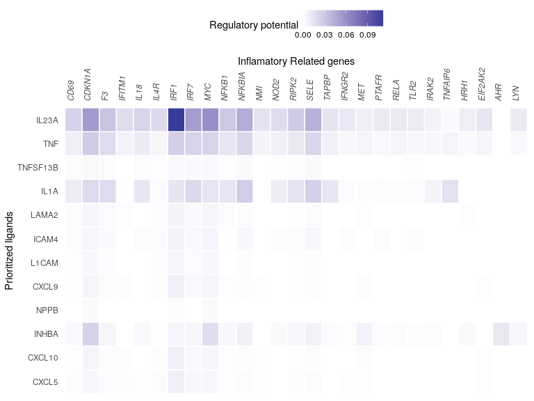
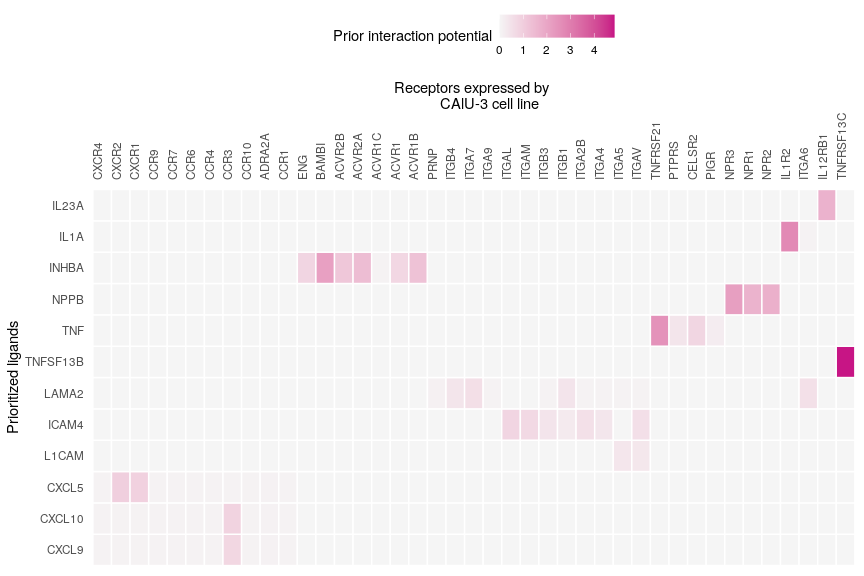
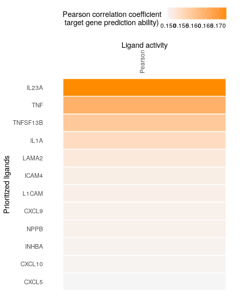

NicheNet’s ligand activity analysis on a gene set of interest: predict
active ligands and their target genes
================
Alberto Valdeolivas: <alberto.valdeolivas@bioquant.uni-heidelberg.de>;
Date:
22/06/2020

## Abstract

This vignette follows the steps of the original vignette, available in
the NicheNetr repository:

<https://github.com/saeyslab/nichenetr/blob/master/vignettes/ligand_activity_geneset.md>

In our particular case, we use sets of interactions availabe in the
**Omnipath** database. We will study potential ligand-targets influence
upon SARS-CoV-2 infection.

## Introduction

A NicheNet analysis can help one to generate hypotheses about an
intercellular communication process of interest for which you have bulk
or single-cell gene expression data. Specifically, NicheNet can predict
1) which ligands from one cell population (“sender/niche”) are most
likely to affect target gene expression in an interacting cell
population (“receiver/target”) and 2) which specific target genes are
affected by which of these predicted ligands.

Because NicheNet studies how ligands affect gene expression in
neighboring cells, you need to have data about this effect in gene
expression you want to study. So, you need to have a clear set of genes
that are putatively affected by ligands from one of more interacting
cells.

The pipeline of a basic NicheNet analysis consist mainly of the
following steps:

  - 1.  Define a “sender/niche” cell population and a “receiver/target”
        cell population present in your expression data and determine
        which genes are expressed in both populations

  - 2.  Define a gene set of interest: these are the genes in the
        “receiver/target” cell population that are potentially
        affected by ligands expressed by interacting cells (e.g. genes
        differentially expressed upon cell-cell interaction)

  - 3.  Define a set of potential ligands: these are ligands that are
        expressed by the “sender/niche” cell population and bind a
        (putative) receptor expressed by the “receiver/target”
        population

  - 4)  Perform NicheNet ligand activity analysis: rank the potential
        ligands based on the presence of their target genes in the gene
        set of interest (compared to the background set of genes)

  - 5)  Infer top-predicted target genes of ligands that are top-ranked
        in the ligand activity analysis

This vignette guides you in detail through all these steps. We are going
to use expression data after SARS-CoV-2 infection to try to dissect
which ligands  
expressed by infected cells can have an influence on the expression of
target genes in the same cell lines (Autocrine view). In particular, we
will focus on the inflamatory response potentially induced by this
ligands.

## Step 0: NicheNet’s ligand-target prior model and expression data of interacting cells

We first loaded the required packages

``` r
library(nichenetr)
library(tidyverse)
library(VennDiagram)
library(fgsea)
```

Then, we read the prior ligand-target model. This model denotes the
prior potential that a particular ligand might regulate the expression
of a specific target gene.

``` r
ligand_target_matrix = readRDS("Results/ligand_target_matrixWithweights.rds")
# target genes in rows, ligands in columns
dim(ligand_target_matrix)
## [1] 12547   840
ligand_target_matrix[1:5,1:5] 
##               CALM1        WNT5A       CXCL16       CCL3L3      TNFSF10
## A1BG   0.0000000000 0.0000000000 0.000000e+00 0.000000e+00 0.0000000000
## A1CF   0.0000000000 0.0000000000 0.000000e+00 0.000000e+00 0.0000000000
## A2M    0.0011027517 0.0004845514 2.936421e-03 5.441192e-03 0.0017391820
## A2ML1  0.0000000000 0.0000000000 0.000000e+00 0.000000e+00 0.0000000000
## A4GALT 0.0002105736 0.0001070804 5.825834e-05 9.488076e-05 0.0001410451
```

We read the differential expression analysis results from several cell
lines upon SARS-CoV-2 infection. We are going to explore which ligands
are overexpressed after infection in different cell lines belonging to
the following dataset: GSE147507
(<https://www.biorxiv.org/content/10.1101/2020.03.24.004655v1>)

``` r
padj_tres <- 0.1
log2FoldChange_tres <- 1

## We take our ligands in the network
ligands <- 
    readRDS("OmniNetworks_NNformat/lr_Network_Omnipath.rds") %>%
    dplyr::pull(from) %>% 
    unique()

DDS_NHBE_ligands <- 
    readRDS("Results/dds_results_NHBEvsCOV2.rds") %>%
    as.data.frame() %>% 
    tibble::rownames_to_column(var = "Gene") %>%
    dplyr::filter(padj < padj_tres, 
                  log2FoldChange > log2FoldChange_tres, 
                  Gene %in% ligands) %>%
    dplyr::pull(Gene)

DDS_CALU3_ligands <- 
    readRDS("Results/dds_results_CALU3vsCOV2.rds") %>%
    as.data.frame() %>% 
    tibble::rownames_to_column(var = "Gene") %>%
    dplyr::filter(padj < padj_tres, 
                  log2FoldChange > log2FoldChange_tres, 
                  Gene %in% ligands) %>%
    dplyr::pull(Gene)

DDS_A549_ligands <- 
    readRDS("Results/dds_results_A549vsCOV2.rds") %>%
    as.data.frame() %>% 
    tibble::rownames_to_column(var = "Gene") %>%
    dplyr::filter(padj < padj_tres, 
                  log2FoldChange > log2FoldChange_tres, 
                  Gene %in% ligands)  %>%
    dplyr::pull(Gene)
```

After checking the overlap between over-expressed ligands in the
different cell lines, we decided to continue with the analysis using
CALU3, since it has the larger number of over-expressed ligands.

``` r
Venn_plot <- draw.triple.venn(length(DDS_NHBE_ligands), 
    length(DDS_CALU3_ligands), 
    length(DDS_A549_ligands), 
    n12 = length(intersect(DDS_NHBE_ligands,
        DDS_CALU3_ligands)), 
    n23 = length(intersect(DDS_CALU3_ligands, 
        DDS_A549_ligands)),
    n13 = length(intersect(DDS_NHBE_ligands, 
        DDS_A549_ligands)), 
    n123 = length(intersect(intersect(DDS_NHBE_ligands, 
        DDS_CALU3_ligands), 
        DDS_A549_ligands)),
    category = c("NHBE", "CALU3","A549"), 
    lty = rep("blank", 3), fill = c("light blue", "red","orange"), 
    alpha = rep(0.25, 3), euler.d = TRUE, scaled=TRUE,
    rotation.degree = 0, reverse=TRUE, cex=1.25, cat.pos = c(330, 30 , 180), 
    cat.dist = rep(0.075, 3), cat.cex = 1.25)
grid.draw(Venn_plot)
```

<!-- -->

## Step 1: Define expressed genes in sender and receiver cell populations

Our research question is to prioritize which ligands overexpressed upon
SARS-CoV-2 in the CALU-3 cell line have an effect in the inflamatory
response in this very same cell line. This can be considered as an
example of autocrine signaling.

Now, we will take again the overexpressed ligands after infection and we
will define as a background all the genes expressed by the CALU3 cells.

``` r
expressed_genes_receiver <- 
    readRDS("Results/dds_results_CALU3vsCOV2.rds") %>%
    as.data.frame() %>% 
    tibble::rownames_to_column(var = "Gene") %>%
    dplyr::filter(!is.na(stat)) %>%
    dplyr::pull(Gene)

## Check the number of ligands and background genes
length(ligands)
## [1] 840
length(expressed_genes_receiver)
## [1] 16818
```

## Step 2: Define the gene set of interest and a background of genes

To establish a gene set of interest, we perform a Gene set Enrichment
analysis (GSEA) and we check among the most appealing overrepresanted
signatures upon SARS-CoV-2 infection. We remove the differentially
expressed ligands from this comparison.

``` r
ranks <- readRDS("Results/dds_results_CALU3vsCOV2.rds") %>%
    as.data.frame() %>%
    tibble::rownames_to_column(var = "Gene") %>%
    dplyr::filter(!(Gene %in% DDS_CALU3_ligands)) %>% 
    dplyr::filter(!is.na(stat)) %>% 
    dplyr::pull(stat, name=Gene) 

# immunologic_signatures <- gmtPathways("NicheNet_Omnipath/c7.all.v7.1.symbols.gmt")
hallmarlk_signatures <- gmtPathways("h.all.v7.1.symbols.gmt")
# go_signatures <- gmtPathways("NicheNet_Omnipath/c5.bp.v7.1.symbols.gmt")

fgseaRes <- fgsea(hallmarlk_signatures, ranks,  nperm=1000)
# Testing only one pathway is implemented in a more efficient manner

SignificantResults <- fgseaRes %>% 
    dplyr::filter(padj < 0.01) %>% 
    dplyr::arrange(desc(NES)) %>% 
    dplyr::top_n(12, abs(NES))
SignificantResults    
##                                pathway        pval        padj         ES
##  1: HALLMARK_INTERFERON_GAMMA_RESPONSE 0.001302083 0.005199667  0.8627654
##  2:   HALLMARK_TNFA_SIGNALING_VIA_NFKB 0.001319261 0.005199667  0.8608318
##  3: HALLMARK_INTERFERON_ALPHA_RESPONSE 0.001461988 0.005199667  0.9172465
##  4:     HALLMARK_INFLAMMATORY_RESPONSE 0.001347709 0.005199667  0.7274370
##  5:   HALLMARK_IL6_JAK_STAT3_SIGNALING 0.001533742 0.005199667  0.7126008
##  6:                   HALLMARK_HYPOXIA 0.001307190 0.005199667  0.5893036
##  7:     HALLMARK_FATTY_ACID_METABOLISM 0.003787879 0.007407407 -0.5010564
##  8:            HALLMARK_G2M_CHECKPOINT 0.004385965 0.007407407 -0.5370578
##  9:            HALLMARK_MYC_TARGETS_V2 0.002793296 0.007407407 -0.6827875
## 10:            HALLMARK_MYC_TARGETS_V1 0.004444444 0.007407407 -0.6785459
## 11:               HALLMARK_E2F_TARGETS 0.004329004 0.007407407 -0.6829123
## 12: HALLMARK_OXIDATIVE_PHOSPHORYLATION 0.004310345 0.007407407 -0.6946604
##           NES nMoreExtreme size                                  leadingEdge
##  1:  3.097636            0  174     OAS2,IFIT1,RSAD2,IFIT2,IFIT3,TNFAIP3,...
##  2:  3.062342            0  161 IFIT2,TNFAIP3,ATF3,PPP1R15A,NFKBIA,IFIH1,...
##  3:  3.037484            0   89        RSAD2,IFIT2,IFIT3,MX1,IFIH1,TXNIP,...
##  4:  2.555097            0  148       NFKBIA,IRF1,LAMP3,IFITM1,KLF6,RTP4,...
##  5:  2.256719            0   67         IRF1,STAT2,MAP3K8,STAT1,JUN,PIM1,...
##  6:  2.114591            0  173  TNFAIP3,ATF3,PPP1R15A,TIPARP,DUSP1,STC2,...
##  7: -2.019464            0  146        ACAT2,DHCR24,NSDHL,FASN,NTHL1,MIF,...
##  8: -2.225125            0  190         KPNA2,MCM5,SQLE,HSPA8,MCM6,LMNB1,...
##  9: -2.352049            0   58         TMEM97,MCM5,PHB,DCTPP1,PLK1,MCM4,...
## 10: -2.821150            0  193           KPNA2,MCM5,PHB,MCM6,SRSF2,NME1,...
## 11: -2.847626            0  195       KPNA2,MCM5,MXD3,SPAG5,NCAPD2,POLD1,...
## 12: -2.876772            0  184      MAOB,POLR2F,COX8A,LDHB,VDAC3,NDUFB2,...
```

``` r
plot_enrichment <- ggplot(SignificantResults, aes(reorder(pathway, NES), NES)) +
  geom_col(aes(fill=-log(pval))) +
  coord_flip() +
  labs(x="Pathway", y="Normalized Enrichment Score",
       title="Hallmark Gene Set NES from GSEA") + 
  theme_minimal()
plot_enrichment
```

<!-- -->

``` r
saveRDS(SignificantResults,file = "Results/Enrichment_Significant_Results.rds")
```

One of the most interesting results is inflamatory response. So, we
define the leading edge genes involved in the inflamatory response as
the target genes, i.e. we want to see how likely is that the secreted
ligands have an effect in this inflamatory response.

``` r
## I am going to check with Inflamatory genes
InflamatoryGenes <- SignificantResults %>% 
    dplyr::filter(pathway == "HALLMARK_INFLAMMATORY_RESPONSE") %>% 
    dplyr::pull(leadingEdge) %>% unlist()

## We chech that there are no upregulated ligands here. 
intersect(DDS_CALU3_ligands,InflamatoryGenes)
## character(0)

geneset_oi <- InflamatoryGenes[InflamatoryGenes %in% rownames(ligand_target_matrix)]

head(geneset_oi)
## [1] "NFKBIA" "IRF1"   "IFITM1" "KLF6"   "RTP4"   "IRAK2"
background_expressed_genes <- expressed_genes_receiver %>%
    .[. %in% rownames(ligand_target_matrix)]
head(background_expressed_genes)
## [1] "SAMD11"   "NOC2L"    "ISG15"    "AGRN"     "TNFRSF18" "SDF4"
```

## Step 3: Define a set of potential ligands

As potentially active ligands, we will use ligands that are 1)
Over-expressed in CALU3 after SARS-CoV-2 infection and 2) can bind a
(putative) receptor expressed by malignant cells. Putative
ligand-receptor links were gathered from Omnipath ligand-receptor data
sources.

``` r
receptors <- unique(lr_network$to)
expressed_receptors <- intersect(receptors,expressed_genes_receiver)

lr_network_expressed <- lr_network %>% 
    filter(from %in% DDS_CALU3_ligands & to %in% expressed_receptors) 
head(lr_network_expressed)
## # A tibble: 6 x 4
##   from  to    source         database
##   <chr> <chr> <chr>          <chr>   
## 1 CXCL1 CXCR2 kegg_cytokines kegg    
## 2 CXCL2 CXCR2 kegg_cytokines kegg    
## 3 CXCL3 CXCR2 kegg_cytokines kegg    
## 4 CXCL5 CXCR2 kegg_cytokines kegg    
## 5 CCL20 CCR6  kegg_cytokines kegg    
## 6 CCL17 CCR4  kegg_cytokines kegg
```

This ligand-receptor network contains the expressed ligand-receptor
interactions. As potentially active ligands for the NicheNet analysis,
we will consider the ligands from this network.

``` r
potential_ligands <- lr_network_expressed %>% pull(from) %>% unique()
head(potential_ligands)
## [1] "CXCL1" "CXCL2" "CXCL3" "CXCL5" "CCL20" "CCL17"
```

## Step 4: Perform NicheNet’s ligand activity analysis on the gene set of interest

In this section, we calculate the ligand activity of each ligand, or in
other words, we will assess how well each over-expressed ligand after
viral infection can predict the inflatmatory response gene set compared
to the background of expressed genes (predict whether a gene belongs to
the inflatmatory response program or not).

``` r
ligand_activities <- predict_ligand_activities(
    geneset = geneset_oi, 
    background_expressed_genes = background_expressed_genes, 
    ligand_target_matrix = ligand_target_matrix, 
    potential_ligands = potential_ligands)
```

We will rank the ligands based on their pearson correlation coefficient.
This allows us to prioritize inflamory response-regulating ligands.

``` r
ligand_activities %>% arrange(-pearson) 
## # A tibble: 89 x 4
##    test_ligand auroc   aupr pearson
##    <chr>       <dbl>  <dbl>   <dbl>
##  1 IL23A       0.742 0.0693   0.173
##  2 TNF         0.753 0.0604   0.165
##  3 TNFSF13B    0.732 0.0568   0.159
##  4 IL1A        0.712 0.0532   0.155
##  5 LAMA2       0.740 0.0597   0.152
##  6 ICAM4       0.731 0.0645   0.151
##  7 L1CAM       0.735 0.0645   0.151
##  8 CXCL9       0.742 0.0771   0.151
##  9 NPPB        0.724 0.0721   0.151
## 10 INHBA       0.677 0.0591   0.150
## # … with 79 more rows
best_upstream_ligands <- ligand_activities %>% 
    top_n(12, pearson) %>% 
    arrange(-pearson) %>% 
    pull(test_ligand)
head(best_upstream_ligands)
## [1] "IL23A"    "TNF"      "TNFSF13B" "IL1A"     "LAMA2"    "ICAM4"
```

We see here that the performance metrics indicate that the 12 top-ranked
ligands can predict the inflamatory genes reasonably, this implies that
ranking of the ligands might be accurate as shown in our study. However,
it is possible that for some gene sets, the target gene prediction
performance of the top-ranked ligands would not be much better than
random prediction. In that case, prioritization of ligands will be less
trustworthy.

``` r
# show histogram of ligand activity scores
p_hist_lig_activity = ggplot(ligand_activities, aes(x=pearson)) + 
  geom_histogram(color="black", fill="darkorange")  + 
  # geom_density(alpha=.1, fill="orange") +
  geom_vline(aes(xintercept=min(ligand_activities %>% top_n(12, pearson) %>% 
    pull(pearson))), color="red", linetype="dashed", size=1) + 
  labs(x="ligand activity (PCC)", y = "# ligands") +
  theme_classic()
p_hist_lig_activity
```

<!-- -->

``` r
saveRDS(ligand_activities,file = "Results/LigandActivityScoreDistribution.rds")
```

## Step 5: Infer target genes of top-ranked ligands and visualize in a heatmap

Now we will show how you can look at the regulatory potential scores
between ligands and target genes of interest. In this case, we will look
at links between top-ranked ligands regulating inflamatory response
genes. In the ligand-target heatmaps, we show here regulatory potential
scores for interactions between the 12 top-ranked ligands and following
target genes: genes that belong to the gene set of interest and to the
250 most strongly predicted targets of at least one of the 12 top-ranked
ligands (the top 250 targets according to the general prior model, so
not the top 250 targets for this dataset). Consequently, genes of your
gene set that are not a top target gene of one of the prioritized
ligands, will not be shown on the heatmap.

``` r
active_ligand_target_links_df <- best_upstream_ligands %>% 
    lapply(get_weighted_ligand_target_links,
           geneset = geneset_oi, 
           ligand_target_matrix = ligand_target_matrix, 
           n = 250) %>% 
    bind_rows()
nrow(active_ligand_target_links_df)
## [1] 179
head(active_ligand_target_links_df)
## # A tibble: 6 x 3
##   ligand target weight
##   <chr>  <chr>   <dbl>
## 1 IL23A  CD69   0.0239
## 2 IL23A  CDKN1A 0.0549
## 3 IL23A  F3     0.0314
## 4 IL23A  IFITM1 0.0185
## 5 IL23A  IL18   0.0232
## 6 IL23A  IL4R   0.0197
```

For visualization purposes, we adapted the ligand-target regulatory
potential matrix as follows. Regulatory potential scores were set as 0
if their score was below a predefined threshold, which was here the 0.10
quantile of scores of interactions between the 10 top-ranked ligands and
each of their respective top targets (see the ligand-target network
defined in the data frame).

``` r
active_ligand_target_links <- prepare_ligand_target_visualization(
    ligand_target_df = active_ligand_target_links_df, 
    ligand_target_matrix = ligand_target_matrix, 
    cutoff = 0.10)
nrow(active_ligand_target_links_df)
## [1] 179
head(active_ligand_target_links_df)
## # A tibble: 6 x 3
##   ligand target weight
##   <chr>  <chr>   <dbl>
## 1 IL23A  CD69   0.0239
## 2 IL23A  CDKN1A 0.0549
## 3 IL23A  F3     0.0314
## 4 IL23A  IFITM1 0.0185
## 5 IL23A  IL18   0.0232
## 6 IL23A  IL4R   0.0197
```

The putatively active ligand-target links will now be visualized in a
heatmap. The order of the ligands accord to the ranking according to the
ligand activity prediction.

``` r
order_ligands <- 
    intersect(best_upstream_ligands, colnames(active_ligand_target_links)) %>% 
    rev()
order_targets <- active_ligand_target_links_df$target %>% 
    unique()
vis_ligand_target <- active_ligand_target_links[order_targets,order_ligands] %>% 
    t()
p_ligand_target_network <- vis_ligand_target %>% 
    make_heatmap_ggplot("Prioritized ligands","Inflamatory Related genes", 
        color = "blue",legend_position = "top", x_axis_position = "top",
        legend_title = "Regulatory potential") + 
        scale_fill_gradient2() +  
            # ) +  
    theme(axis.text.x = element_text(face = "italic"))
p_ligand_target_network
```

<!-- -->

``` r
saveRDS(vis_ligand_target,file = "Results/Ligand_Target_Matrix.rds")
```

Note that the choice of these cutoffs for visualization is quite
arbitrary. We recommend users to test several cutoff values.

If you would consider more than the top 250 targets based on prior
information, you will infer more, but less confident, ligand-target
links; by considering less than 250 targets, you will be more stringent.

If you would change the quantile cutoff that is used to set scores to 0
(for visualization purposes), lowering this cutoff will result in a more
dense heatmap, whereas highering this cutoff will result in a more
sparse heatmap.

## Follow-up analysis 1: Ligand-receptor network inference for top-ranked ligands

One type of follow-up analysis is looking at which receptors can
potentially bind to the prioritized ligands.

So, we will now infer the predicted ligand-receptor interactions of the
top-ranked ligands and visualize these in a heatmap.

``` r
## get the ligand-receptor network of the top-ranked ligands
lr_network_top <- lr_network %>% 
    filter(from %in% best_upstream_ligands & to %in% expressed_receptors) %>% 
    distinct(from,to)

best_upstream_receptors <- lr_network_top %>% pull(to) %>% unique()

## get the weights of the ligand-receptor interactions as used in the NicheNet model
weighted_networks <- readRDS("Results/weighted_networksWithSourceWeights.rds")

lr_network_top_df <- weighted_networks$lr_sig %>% 
    filter(from %in% best_upstream_ligands & to %in% best_upstream_receptors)

## convert to a matrix
lr_network_top_df <- lr_network_top_df %>% 
    spread("from","weight",fill = 0)
lr_network_top_matrix <- lr_network_top_df %>% 
    select(-to) %>% 
    as.matrix() %>% 
    magrittr::set_rownames(lr_network_top_df$to)

## perform hierarchical clustering to order the ligands and receptors
dist_receptors <- dist(lr_network_top_matrix, method = "binary")
hclust_receptors <- hclust(dist_receptors, method = "ward.D2")
order_receptors <- hclust_receptors$labels[hclust_receptors$order]
dist_ligands <- dist(lr_network_top_matrix %>% t(), method = "binary")
hclust_ligands <- hclust(dist_ligands, method = "ward.D2")
order_ligands_receptor <- hclust_ligands$labels[hclust_ligands$order]
```

Show a heatmap of the ligand-receptor interactions

``` r
vis_ligand_receptor_network <- 
    lr_network_top_matrix[order_receptors, order_ligands_receptor]
p_ligand_receptor_network <- vis_ligand_receptor_network %>% 
    t() %>% 
    make_heatmap_ggplot("Prioritized ligands","Receptors expressed by 
        CAlU-3 cell line", color = "mediumvioletred", x_axis_position = "top",
        legend_title = "Prior interaction potential")
p_ligand_receptor_network
```

<!-- -->

``` r
saveRDS(vis_ligand_receptor_network,file = "Results/Ligand_Receptor_Matrix.rds")
```

## Follow-up analysis 2: Visualize expression of top-predicted ligands and their target genes in a combined heatmap

NicheNet only considers expressed ligands of sender cells, but does not
take into account their expression for ranking the ligands. The ranking
is purely based on the potential that a ligand might regulate the gene
set of interest, given prior knowledge. Because it is also useful to
further look into expression of ligands and their target genes, we
demonstrate here how you could make a combined figure showing ligand
activity, ligand expression, target gene expression and ligand-target
regulatory potential.

``` r
library(RColorBrewer)
library(cowplot)
library(ggpubr)
```

#### Prepare the ligand activity matrix

``` r
ligand_pearson_matrix <- ligand_activities %>% 
    select(pearson) %>% 
    as.matrix() %>% 
    magrittr::set_rownames(ligand_activities$test_ligand)

vis_ligand_pearson <- ligand_pearson_matrix[order_ligands, ] %>% 
    as.matrix(ncol = 1) %>% 
    magrittr::set_colnames("Pearson")
```

``` r
p_ligand_pearson <- vis_ligand_pearson %>% 
    make_heatmap_ggplot("Prioritized ligands","Ligand activity", 
    color = "darkorange",legend_position = "top", x_axis_position = "top", 
    legend_title = "Pearson correlation coefficient \n target gene prediction ability)")
p_ligand_pearson
```

<!-- -->

``` r
saveRDS(vis_ligand_pearson, file = "Results/ligand_Pearson.rds")
```

## References

Browaeys, R., Saelens, W. & Saeys, Y. NicheNet: modeling intercellular
communication by linking ligands to target genes. Nat Methods (2019)
<doi:10.1038/s41592-019-0667-5>

Puram, Sidharth V., Itay Tirosh, Anuraag S. Parikh, Anoop P. Patel,
Keren Yizhak, Shawn Gillespie, Christopher Rodman, et al. 2017.
“Single-Cell Transcriptomic Analysis of Primary and Metastatic Tumor
Ecosystems in Head and Neck Cancer.” Cell 171 (7): 1611–1624.e24.
<https://doi.org/10.1016/j.cell.2017.10.044>.
