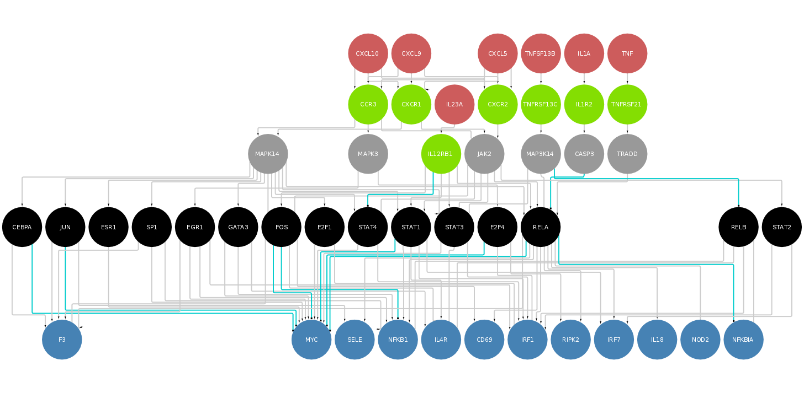
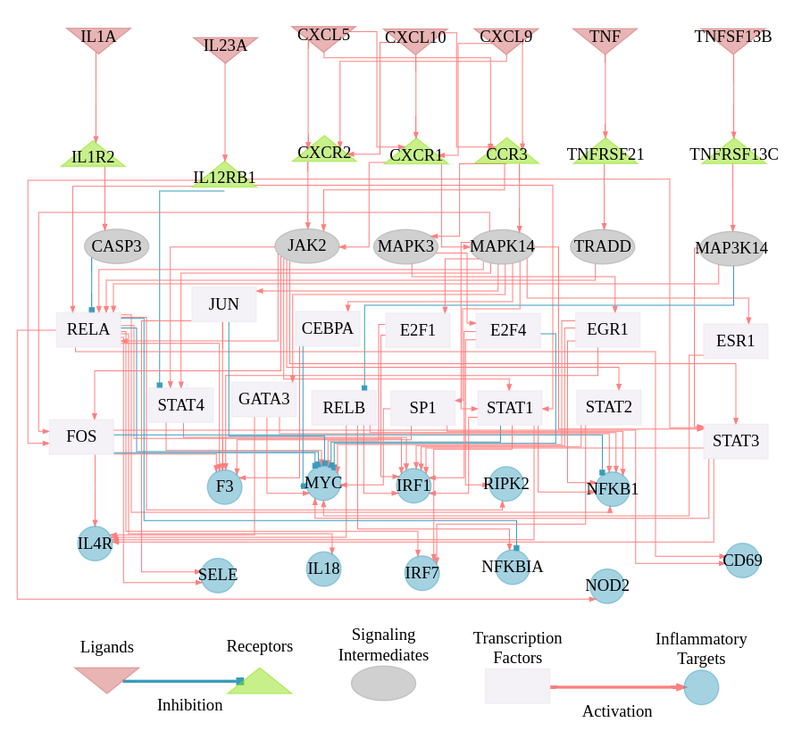

NicheNet Results: Ligand-Targets interesting paths
================
Alberto Valdeolivas: <alberto.valdeolivas@bioquant.uni-heidelberg.de>;
Date:
15/06/2020

## Results

This vignette contains the code to generate the most interesting path
going from the most relevant ligands to their targets going throught
receptors, signaling intermediates and TFs.

We first load the required libraries and read the previously generated
results:

``` r
library(nichenetr)
library(tidyverse)
library(igraph)
library(OmnipathR)

weighted_networks <- readRDS("Results/weighted_networksWithSourceWeights.rds")
ligand_tf_matrix <- readRDS("Results/ligand_target_matrixWithweights.rds")

lr_network <- readRDS("OmniNetworks_NNformat/lr_Network_Omnipath.rds")
sig_network <- readRDS("OmniNetworks_NNformat/sig_Network_Omnipath.rds")
gr_network <- readRDS("OmniNetworks_NNformat/gr_Network_Omnipath.rds")
```

We then select the most relevant ligands, receptors and targets.

``` r
ligands <- c("IL23A","IL1A","TNF","TNFSF13B","CXCL9","CXCL10","CXCL5")
receptors <- c("CXCR2","CXCR1","CCR3","IL1R2","IL12RB1","TNFRSF21",
  "TNFRSF13C")
targets <- 
    c("CDKN11","F3","IRF1", "IRF7", "MYC", "NFKB1", "NFKBIA", "SELE", "RIPK2",
      "NOD2", "IL18", "CD69", "IL4R")
```

We then select the ligand receptor interactions and the Gene regulatory
interactions involving the genes defined above.

``` r
LigRec_Interactions <- lr_network %>%
    dplyr::filter(from %in% ligands & to %in% receptors) %>% 
    dplyr::distinct(from,to) %>% 
    dplyr::mutate(type = "LigReceptor")

GeneRegulatory_Interactions <- weighted_networks$gr %>%
    dplyr::filter(!(from %in% c(ligands,receptors,targets))) %>%
    dplyr::filter(to %in% targets)  %>%
    dplyr::distinct(from,to,.keep_all = TRUE) %>%
    dplyr::mutate(type = "GeneRegulation") 

## I am going to select the TFs with the best weights in the interactions 
## related to the target genes. K defines the number of TFs to be selected.
k <- 20
TFs <- GeneRegulatory_Interactions  %>%
    group_by(from) %>% 
    mutate(weight = sum(weight)) %>% 
    ungroup() %>% 
    arrange(desc(weight)) %>% 
    pull(from) %>% 
    unique %>%
    .[1:k]
```

What are the most important TFs in this context? I now compute the
distance between receptors and TFs in the signaling network.

``` r
sig_network_noDup <-sig_network %>%
    dplyr::distinct(from,to) 

sig_network_igraph <-
    graph_from_data_frame(sig_network_noDup, directed = TRUE)

Distance_Receptor_TF <- 
    distances(sig_network_igraph, receptors, TFs, mode = c("out"))

## For every row (Receptors) we select the closest column (TF)
receptorTO_TFs_graph <- make_empty_graph(n = 0, directed = TRUE)

for (i in seq(nrow(Distance_Receptor_TF))){
    receptor <- rownames(Distance_Receptor_TF)[i]
    closestTF <- 
        names(which(Distance_Receptor_TF[i,] == min(Distance_Receptor_TF[i,])))
    sp <- shortest_paths(sig_network_igraph, receptor, closestTF, 
                         output = c("both"))
    temporal_graph <- do.call(graph.union, lapply(sp$epath, function(x) 
        subgraph.edges(sig_network_igraph,eids = x)))
    
    receptorTO_TFs_graph <- graph.union(receptorTO_TFs_graph,temporal_graph)
}    


## For clarity also of the flow, we also remove signaling interactions to the 
## receptors
SignalingInteractions <- igraph::as_data_frame(receptorTO_TFs_graph) %>% 
    mutate(type="Signaling") %>%
    dplyr::filter(!(to %in% receptors)) 

## We remove those interactions from TFs that are connected to the ligands 
## via the signaling network. 
GeneRegulatory_Interactions <- 
    dplyr::filter(GeneRegulatory_Interactions,from %in% 
                unique(c(SignalingInteractions$from, SignalingInteractions$to)))
```

We generate the final graph and export it to a cytoscape compatible
format.

``` r
## We generate the final graph
Final_graph <- dplyr::bind_rows(LigRec_Interactions, 
    SignalingInteractions,
    GeneRegulatory_Interactions) %>% 
    dplyr::distinct(from, to, .keep_all = TRUE)

## We generate a table with the node information (attributes)
All_genes <- unique(c(Final_graph$from,Final_graph$to))

Table_attributes <- 
    tibble(Gene = All_genes, Role = character(length = length(All_genes)))

Table_attributes <- dplyr::mutate(Table_attributes, Role = 
    ifelse(Gene %in% ligands, "ligand",
    ifelse(Gene %in% receptors, "receptor", 
    ifelse(Gene %in% targets, "target", 
    ifelse(Gene %in% TFs, "transcriptionFactor", "SignalingMediator")))))
    
### Check with Omnipath the sign of the interactions!!

AllInteractionsOmnipath <- import_all_interactions() %>%
    dplyr::select(source_genesymbol, target_genesymbol, consensus_direction, 
                  consensus_stimulation, consensus_inhibition)  %>%
    dplyr::distinct(source_genesymbol, target_genesymbol, .keep_all = TRUE) 

Final_graph <- dplyr::left_join(Final_graph, AllInteractionsOmnipath, 
    by = c("from" = "source_genesymbol", "to" = "target_genesymbol")) %>% 
    dplyr::mutate(interaction_sign = ifelse(consensus_inhibition == 1, -1 ,1)) %>%
    dplyr::select(c(from,to,type, interaction_sign)) %>%
    dplyr::mutate_all(~replace(., is.na(.), 1))

### Export to cytoscape:

write_tsv(Final_graph, "Results/Cytoscape/Network_ToDraw.txt")
write_tsv(Table_attributes, "Results/Cytoscape/annotation_table.txt")
```

<br><br>  <br><br>

#### Export to .DOT files.

``` r
Dot_text <- NULL
Dot_text <- c(Dot_text, "digraph {")
Dot_text <- c(Dot_text, "")
Dot_text <- c(Dot_text, "node [fixedsize = \"true\" ]")


for (i in seq_len(length.out = nrow(Final_graph))) {
  ArrowType <- 
    ifelse(Final_graph$interaction_sign[i] == 1, "\"vee\"", "\"tee\"")
  ArrowColor <-
    ifelse(Final_graph$interaction_sign[i] == 1, "\"#FFCCCB\"", "\"#ADD8E6\"")
  Dot_text <- 
    c(Dot_text, paste0(Final_graph$from[i], "->", Final_graph$to[i], 
      " [penwidth=1", ", color=", ArrowColor[1], ", arrowhead=", ArrowType[1], 
                "];"))
}

for (i in seq_len(length.out = nrow(Table_attributes))){
  Shape <- 
    ifelse(Table_attributes$Role[i]=="ligand", "invtriangle", 
      ifelse(Table_attributes$Role[i]=="receptor", "triangle", 
        ifelse(Table_attributes$Role[i]=="SignalingMediator", "ellipse",
          ifelse(Table_attributes$Role[i]=="transcriptionFactor", "box",
          "circle"))))
  # fillcolor <- "lavander"
    Dot_text <- 
    c(Dot_text, paste0(Table_attributes$Gene[i], " [style=filled, ", 
      "fillcolor=lavender, ", "color=lavender, ", "shape = ", Shape,"];"))
  
  
}
Dot_text <- c(Dot_text, "")
Dot_text <- c(Dot_text, "}")

# writeLines(Dot_text, "Results/Cytoscape/Network_Figure5.dot")
```

<br><br> 
<br><br>
